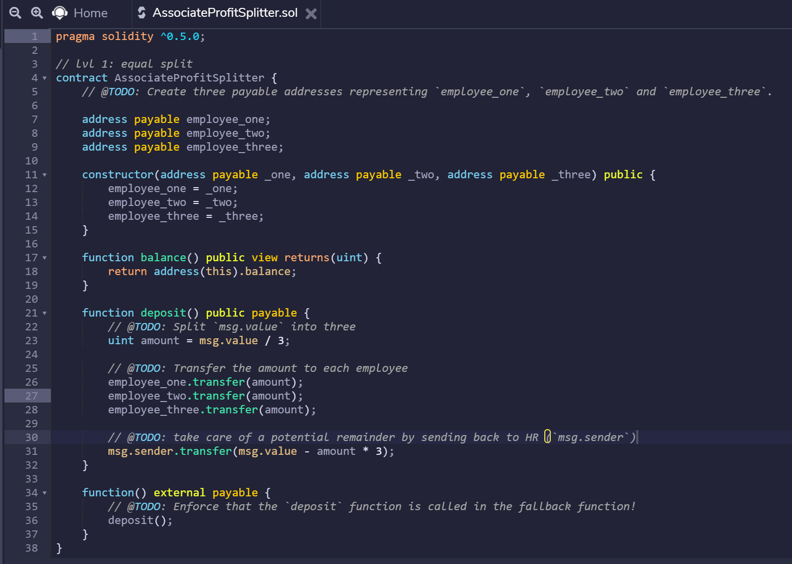

# homework_solidity

Nick Nordby

Solidity Homework Submission

**Note:** I was out of town for most of the week, so I was only able to attempt one of the levels (Level One), which is all that is required for the homework submission.

**Setup:**

Programs: Ganache; MetaMask; Remix (Solidity)

Compiler: 0.5.0+

Network ID: 5777

Server: HTTP://127.0.0.1:8545

**Questions:**

*Question 1: How does the contract work?*

A solidity contract is a collection of code and data that lives on the blockchain. In this scenario, we used Remix to write and deploy the contract, along with Ganache & MetaMask to help store our ethereum and manage the keys.

This particular contract works by taking a specificed amount of eth from one address, splitting it into three, and dispersing those amounts equally amongst three designated addresses.

*Question 2: What is the motivation?*

The motivation of this assignment is to create a smart contract on solidity that can help manage and automate the dispersion of profits to employees (essentially payroll). This may be done more cheaply and more efficiently on the blockchain.

**Screenshots:**

*How to send & process a transaction:*

First, write the code (code file also attached):

Second, compile the code:

Third, deploy the code:

Fourth, confirm via MetaMask:

Fifth, look for confirmation notification:

Sixth, further confirm by taking note of deployed contract in Remix:

